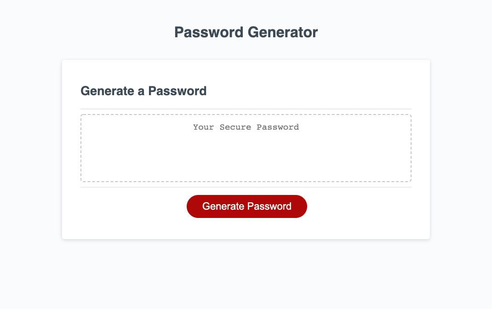

# password-genie
A password generator

## Project Description
-The goal of this project was to offer users a series of choices, before randomly generating a password based on those choices. 
-I learned: 
    <>How to use prompt(), alert(), and confirm(). 
    <>How to validate user input with conditionals. 
    <>How to create and manipulate arrays in javascript. 
    <>How to create larger arrays out of smaller ones. 
    <>How to make a random selection from an array. 
    <>How to iterate a function using a for loop. 

## Usage
-Clicking the "Generate Password" button will initiate a series of popup boxes to gather input from the user. 
-The first popup will prompt the user for a number from 8 to 128. Values outside of that range will alert the user before closing. 
-The subsequent four popups will confirm if the user would like their password to include uppercase letters, lowercase letters, numbers, and/or special characters, respectively. Failure to confirm at least one of these options will alert the user before closing. 
-After answering all popups, a password will be generated for the user based on their selections. 
-Each character is chosen by first randomly selecting which of the four character types to pull from. Then a character is chosen from that array, and added to the user's password. This function iterates until the password reaches the desired length. 
-The password will then display onscreen, until the user attempts to generate another password. 
https://sammn721.github.io/password-genie/ 
